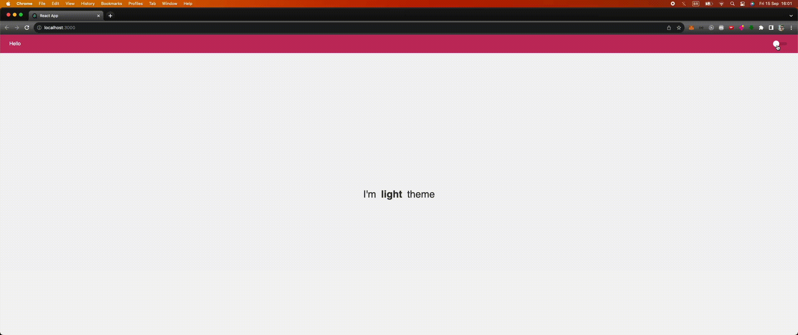

<h4 align="center">
  🚀 Theme Switch
</h4>

<p align="center">
  <a href="#-technology">Technology</a>&nbsp;&nbsp;&nbsp;|&nbsp;&nbsp;&nbsp;
  <a href="#-project">Project</a>&nbsp;&nbsp;&nbsp;|&nbsp;&nbsp;&nbsp;
  <a href="#-executing">Executing</a>&nbsp;&nbsp;&nbsp;
</p>

<p align="center">
  
</p>

## :rocket: Technology

:point_down: This project was developed with: :point_down:

-  [ReactJS](https://nodejs.org/en)
-  [Typescript](https://www.typescriptlang.org/)
-  [Styled Components](https://styled-components.com/)
-  [Local Storage](https://developer.mozilla.org/en-US/docs/Web/API/Window/localStorage)

## 🔖 Project

Application that allows you to change themes according to the user's desire and save your choice in local storage

## 💻 Executing

```bash
# Clone this project
$ git clone https://github.com/italo-lima/theme-switch.git
# Join folder
$ cd themeswitch
# Install dependencies
$ yarn
# Run application
$ yarn start
```
